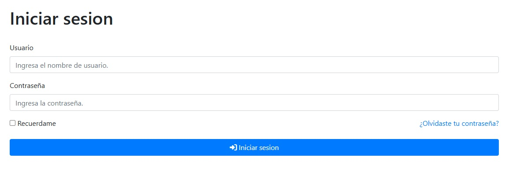
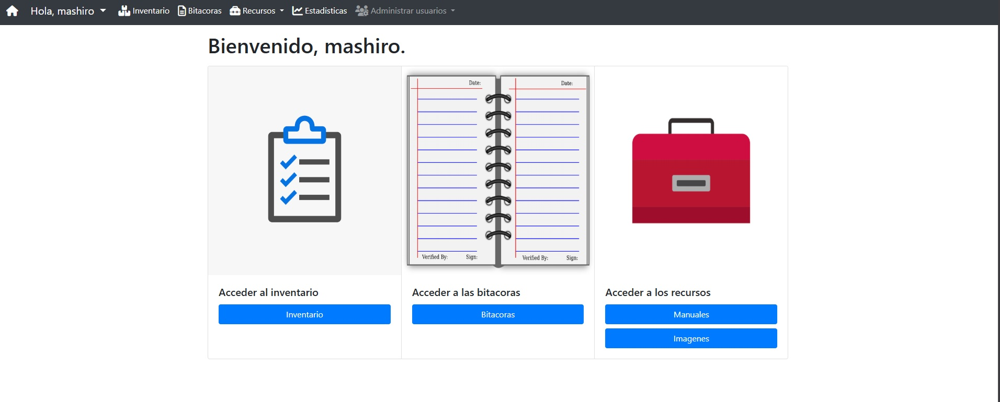
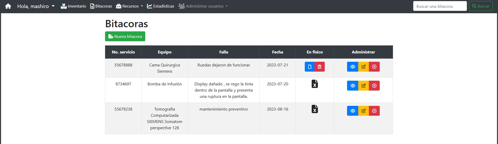
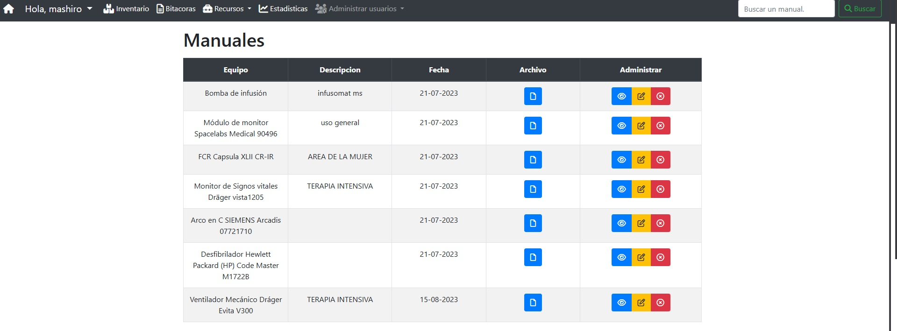
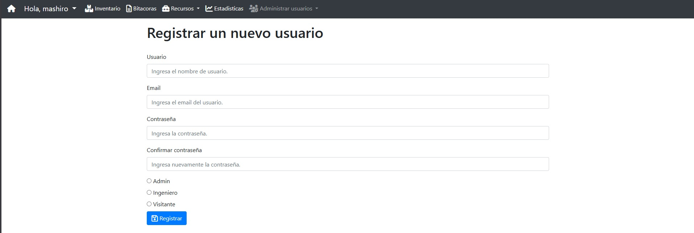

# 🚀 PLAGIMED


> La plataforma Open Source para inventarios medicos que tu area de Ingenieria Biomedica necesita.  
> Con PLAGIMED puedes crear bitacoras, almacenar equipos e imagenes o manuales, administrar usuarios gerenciales, tener estadisticas y mucho mas.

---

## 📌 Tabla de Contenidos

- [📖 Descripción](#-descripción)
- [⚙️ Tecnologías](#️-tecnologías)
- [🖼️ Capturas de Pantalla](#️-capturas-de-pantalla)
- [🤝 Contribuciones](#-contribuciones)
- [📜 Licencia](#-licencia)

---

## 📖 Descripción

Este proyecto es una aplicación desarrollada con **Laravel** que permite:

- ✅ Hacer inventarios medicos.
- ✅ Guardar manuales y bitacoras.
- ✅ Administrar acceso a la informacion.

Con PLAGIMED, toda la informacion que subas y almacenes en tu base de datos quedara accesible para todo aquel que tenga acceso al sitio.

---

## ⚙️ Tecnologías

- 🧩 Laravel
- 🐘 PHP
- 🗄️ MySQL
- 🎨 Bootstrap
- ⚡ JavaScript

---

## 🖼️ Capturas de Pantalla

### 🔐 Pantalla de Login


---

### 🔐 Pantalla de Inicio


---

### 🗄️ Inventario Principal


---

### 📊 Módulo de Bitacoras


---

### 📄 Modulo de Manuales


---

### 🔐 Modulo de Creacion de Usuarios


---

## Contribuciones

Este projecto fue realizado por Jorge Eliseo Arguello Zuñiga,

## Licencia

Este proyecto es de libre uso.

### 1️⃣ Clonar el repositorio

```bash
git clone https://github.com/KleyMa/PlataformaProyecto
cd PlagiMed